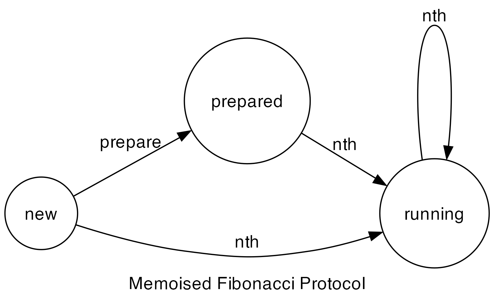

# typestate-v

## Description

Proof of concept for a typestate checker for V. This is built as a part of my MSc thesis at the University of Glasgow.

Long term goal is to merge this into the V compiler itself as an additional stage before `cgen`.

### What is typestate?

There are instances where we want to enforce a certain order of operations on a type. For example, we want to ensure that a file is opened before it is read from. We can definitely do this with a runtime check, but it would be better if we could do this at compile time.

We describe the order of operations on a type using an ordered list of _states_ that a type can be in. Then the relationship between these states is described in a _protocol_ that essentially contains information needed to build a finite state machine.

We then traverse the [AST](https://en.wikipedia.org/wiki/Abstract_syntax_tree) during compilation and check that the operations on a type are in the correct order. Therefore, we obtain the etymology of the name _typestate_; attaching states to types and using a state-machine to check the validity of the protocol.

## Pre-requisites

### Install V from source.

It is recommended to follow the instructions from
the [official documentation](https://github.com/vlang/v/blob/master/README.md#installing-v-from-source).

If you're on a Unix-like system, you can run the following commands to install V from source:

```bash
cd some/appropriate/path
git clone --depth=1 https://github.com/vlang/v
cd v
make
```

If on Windows, please refer to the additional instructions in the official documentation.

### Symlink the `v` binary.

Ensure that the `v` binary is in your `PATH` by symlinking it:

```bash
sudo ./v symlink
```

The process is similar on Windows. Refer to the official documentation for more details.

Test that the installation was successful by running:

```bash
v version
```

### Updating V

Once V is installed, you can update it by running:

```bash
v up
```

## Usage

Clone this repository:

```bash
cd some/appropriate/path
git clone ...
cd typestate_v
```

Run the main binary with:

```bash
v run . [path/to/case/study]
```

If you want to view the help information, run:

```bash
v run . help
```

To run the typestate checker on all enabled case studies, run:

```bash
v run . case-study
```

To generate a graph of the finite state machine for a case study, run:

```bash
v run . viz [path/to/case/study]
```

It will output the DOT representation of the graph to the terminal. If you have `graphviz` installed, a PNG image will be generated in the same directory as the case study.

## Case Studies

### Directory Structure

The case studies are located in the `src/case_studies` directory. Each case study is contained in its own directory. There are sub-directories for each case study indicating different inputs and expected errors (if any).

### Running a Case Study

Simply run:

```bash
v run [path/to/case/study]
```

Notice the lack of a `.` before the path. This is because we are running the case-study, not the main typestate checker.

## Protocol Syntax

A valid protocol is an instance of the `tpstv.Protocol` type. It is defined as follows:

```v
pub struct Protocol[T, S] {
	name        string    [required]
	description string
	rules       []Rule[S] [required]
}

pub struct Rule[S] {
	name        string [required]
	description string
	start       S      [required]
	end         S      [required]
	stimulus    string [required]
}
```

The `T` type parameter is the type that the protocol is defined for. The `S` type parameter is the type of the states in the protocol which is defined using an enumeration (aka _enum_). The `name` field is the name of the protocol. The `description` field is a description of the protocol. The `rules` field is a list of rules that define the protocol.

A rule is defined by a `name`, `description`, `start`, `end` and `stimulus`. The `name` field is the name of the rule. The `description` field is a description of the rule. The `start` field is the starting state of the rule. The `end` field is the ending state of the rule. Both of these must be valid enum values defined in the associated typestate enum.

The `stimulus` field is the stimulus that causes the transition from the starting state to the ending state. This is defined using a string and is in the format `Type.method`. In case of static methods, the format is `Type.static.method`. The `Type` must be the same as the type that the protocol is defined for.

A few more validation rules are applied to ensure that we can build a valid discrete finite state machine from the protocol.

Check the `src/case_studies` directory for examples of protocols. Here are some of the valid protocols in graphical form:




## Adding a Case Study

1. Create a new directory in `src/case_studies` with the name of the case study.
2. Create a `[name].v` file in a sub-directory called `case03_normal`.
3. Create a `protocol.v` file in the same directory.
4. Write a valid stand-alone V program in the `[name].v` file.
5. Make sure that the `protocol.v` file contains an enum of the states that the target type can be in.
6. Define a constant `protocol` of the type `tpstv.Protocol` in the `protocol.v` file.
7. Make sure the typestate checker passes on the case study.
8. Add more variants based on the other examples.

Currently, only one protocol is supported per project but it can be modified to support multiple protocols.
