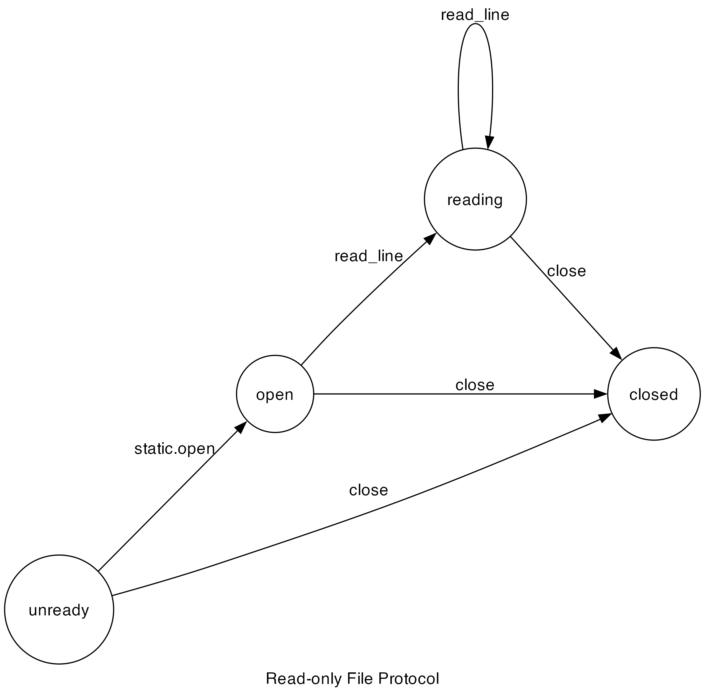

# Read-only File

## Description

A simple case-study that demonstrates the following features:
1. Struct embedding
2. Supporting imported vlib modules.
3. For statement analysis.
4. Recursively scanning method calls.
5. Managing multiple instances.

## Protocol

## Running the Project

Running the example: `v run src/case_studies/01_read_only_file/case03_normal`

Checking the protocol: `v run . src/case_studies/01_read_only_file/case0X_...`
