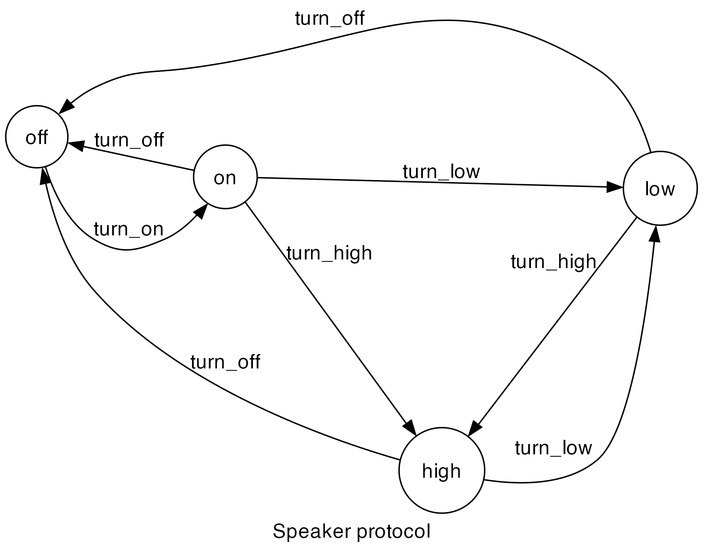

# Speaker

## Description

A case-study that demonstrates the following features:
1. Instantiation with default state.
2. Recursively scanning method calls.
3. Managing multiple instances.
4. Protocol for an embedded system.

## Protocol

## Running the Project

Running the example: `v run src/case_studies/02_speaker/case03_normal`

Checking the protocol: `v run . src/case_studies/02_speaker/case0X_...`
