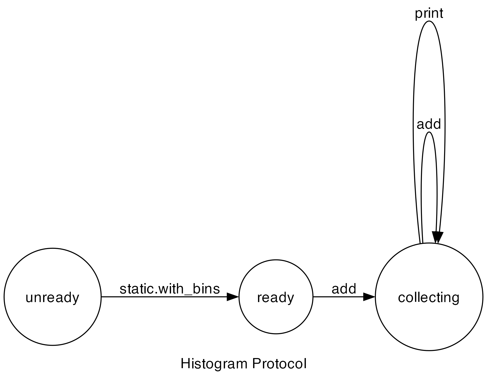

# Histogram

## Description

A simple case-study that demonstrates the following features:
1. Static instantiation with default state.
2. More imported vlib modules.
3. For statement analysis.
4. Managing multiple instances.

## Protocol

## Running the Project

Running the example: `v run src/case_studies/03_histogram/case03_normal`

Checking the protocol: `v run . src/case_studies/03_histogram/case0X_...`
