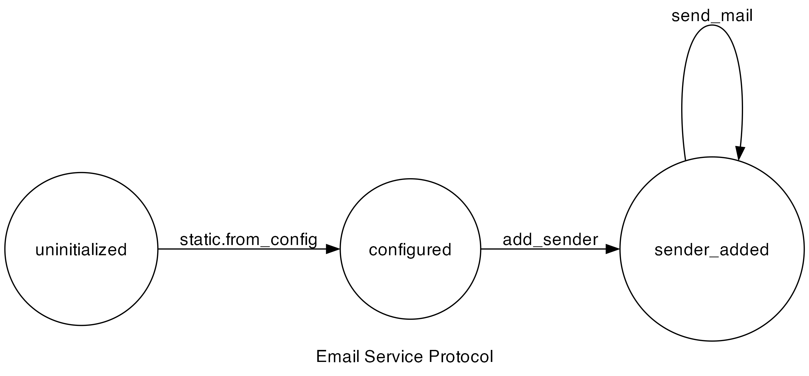

# Histogram

## Description

A simple case-study that demonstrates the following features:
1. Static instantiation with from configuration file.
2. Non-trivial real-world example.
3. Loop construct support.

## Protocol

## Running the Project

Running the example: `v run src/case_studies/04_email_api/case03_normal`

Checking the protocol: `v run . src/case_studies/04_email_api/case0X_...`
