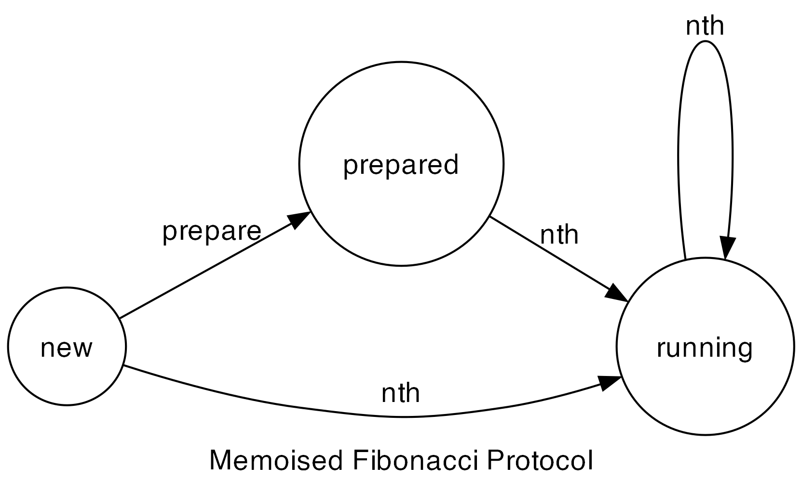

# Fibonacci

## Description

A simple case-study that demonstrates the following features:
1. Optional non-reversible preparation step.
2. Compatible with existing vlib types.
3. Loop construct support.
4. Recursion support.

## Protocol

## Running the Project

Running the example: `v run src/case_studies/05_fibonacci/case03_normal`

Checking the protocol: `v run . src/case_studies/05_fibonacci/case0X_...`
